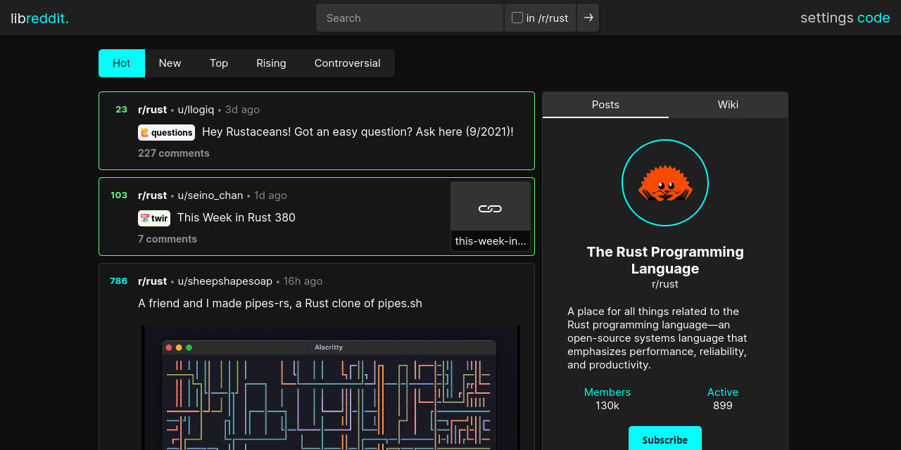

<!--
N.B.: This README was automatically generated by https://github.com/YunoHost/apps/tree/master/tools/README-generator
It shall NOT be edited by hand.
-->

# Libreddit for YunoHost

[](https://dash.yunohost.org/appci/app/libreddit)    
[](https://install-app.yunohost.org/?app=libreddit)

*[Lire ce readme en français.](./README_fr.md)*

> *This package allows you to install Libreddit quickly and simply on a YunoHost server.
If you don't have YunoHost, please consult [the guide](https://yunohost.org/#/install) to learn how to install it.*

## Overview

Libreddit is a portmanteau of "libre" (meaning freedom) and "Reddit". It is a private front-end like Invidious but for Reddit. Browse the coldest takes of r/unpopularopinion without being tracked.

### Features

    🚀 Fast: written in Rust for blazing fast speeds and memory safety
    ☁️ Light: no JavaScript, no ads, no tracking, no bloat
    🕵 Private: all requests are proxied through the server, including media
    🔒 Secure: strong Content Security Policy prevents browser requests to Reddit


**Shipped version:** 0.22.8~ynh1

**Demo:** https://libreddit.spike.codes/

## Screenshots



## Documentation and resources

* Official app website: https://libreddit.spike.codes/
* Upstream app code repository: https://github.com/spikecodes/libreddit
* YunoHost documentation for this app: https://yunohost.org/app_libreddit
* Report a bug: https://github.com/YunoHost-Apps/libreddit_ynh/issues

## Developer info

Please send your pull request to the [testing branch](https://github.com/YunoHost-Apps/libreddit_ynh/tree/testing).

To try the testing branch, please proceed like that.
```
sudo yunohost app install https://github.com/YunoHost-Apps/libreddit_ynh/tree/testing --debug
or
sudo yunohost app upgrade libreddit -u https://github.com/YunoHost-Apps/libreddit_ynh/tree/testing --debug
```

**More info regarding app packaging:** https://yunohost.org/packaging_apps